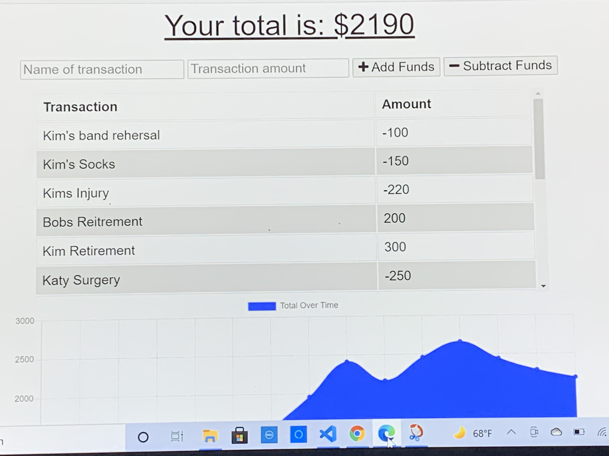

# Title
On and Offline Budget Tracking

# Descipriton
Out assignment was to give offline functionality to a budget tracker app that only worked when it had internet connection. Our goal with online functionality was to have the transaction recoginzed by our indexdb database and then saved/submitted when the internet connection was restablished. We also had to add a service worker to the application and a manifest to the application as well

# Assignment Tasks
1. Let the user get notifed when they added an expense or deposit to their budgets
2. To have the deposits or expenses submitted and saved once they restablish internet connection
3. To add a manifest file
4. To deploy the applicatoin to heroku

# Tasks Achieved By:
The tasks were achieved by reading the getting start instructions which pointed me to what lessons in the modules I needed to review. The modules were able to give clear instructions in what to do to get everything working. The other thing that helped was adapting the steps in the modules to this project we had instead of copying the code straight from the modules.

# Link to Deploye Applicaiton:
<a href="https://limitless-hollows-50105.herokuapp.com/">Link To Application</a>

# Screenshot of Application:

# Packages Used:
compression, express, morgan, and mongoose

# Contributors:
Josh Jackson